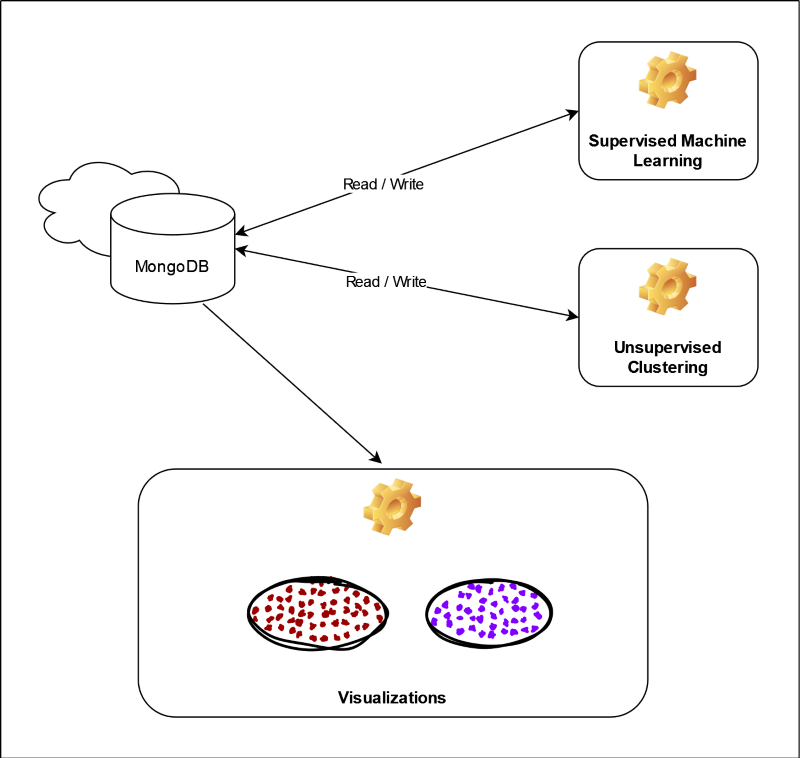
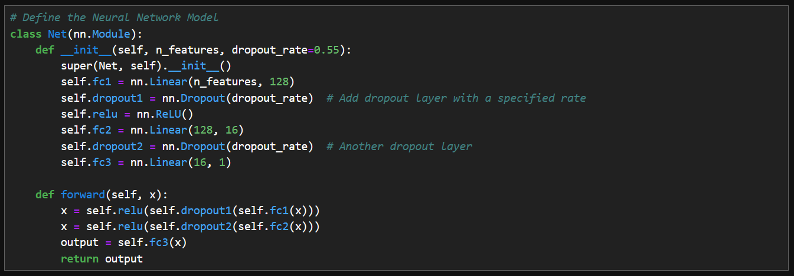
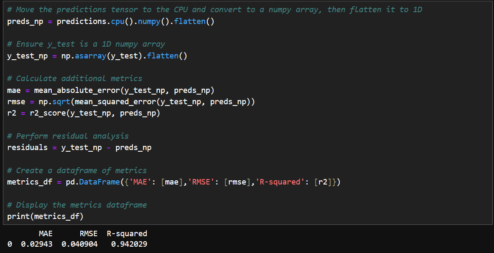
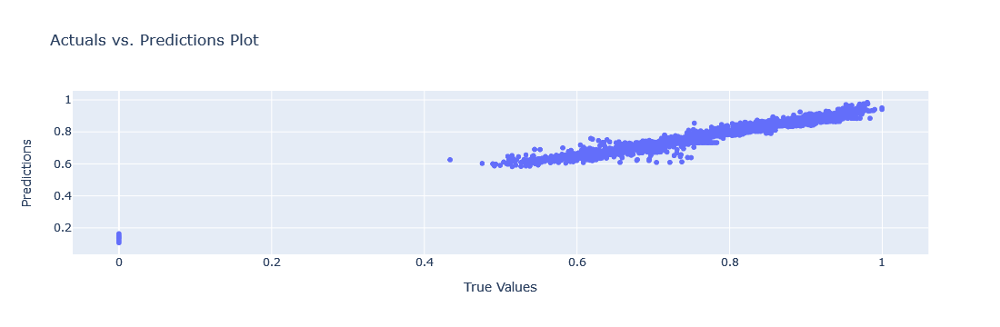

# Expect life Redux - An Ongoing Reimplementation Exploring Global Life Expectancies 

### Project Background Overview and Purpose
There are continuing discussions in American politics about the need for changes in the national healthcare system.  In recent elections, candidates have proposed the adoption of universal healthcare and other similar large-scale changes to America's healthcare system.  This team project explores attributes that may have the largest impact on life expectancy worldwide, and its connection to national social security systems. Using data retrieved from nations around the world, the team seeks to explore whether the type of national healthcare system affects the longevity of the population. Through data exploration, data analysis, and presentation of findings through dashboard and visuals, the team's analysis hopes to answer the following questions:  

* Does the type of social security system have any impact on life expectancy?
* Does the amount of healthcare funding impact life expectancy at all?
* Does a country's GDP impact life expectancy?
* Do selected lifestyle factors (for example, alcohol consumption, smoking) play a role in life expectancy?

#### A Caveat:    
During data exploration, there was only healthcare system data available for less than half of the world's nations.  However, there is sufficient information available for the majority of the world's social security systems.  These social security systems include healthcare as well as providing money for retirement and assistance for accidents and emergencies.

# Expect Life Redux - Project Overview and Purpose
This solo project continues the previous team research, but includes additional data with different processing techniques. The main goal of the project is to attempt to ascertain whether social security systems (or individual components) are connected to human life expectancy. This project also introduces the type of government into the analysis for exploration.

## Project Sub-purpose
As the clustering analysis was underway, it was discovered that there is on-going research into the methods for reducing data dimensionality for clustering and for subsequent visualization. Because of the relevance of this topic to the desired analysis, this became a new goal for the project. The project is performing a high-level comparison of the impact of no dimensionality reduction vs. Principal Component Analysis vs. Primary Feature Analysis.

### Technology Used: 
* Data Exploration: Python, Pandas, Jupyter Notebook
* Database: MongoDB free tier - M0 cloud database
* Machine Learning: Python, PyTorch, Scikit-Learn, NumPy
* Presentation: HVPlot, Seaborn, UMAP, and YData_Profiling

#### Social Security System General Definitions
Note:  In all cases, parenthetical benefits are defined as the ONLY benefits provided by the system.
* Social assistance system: A scheme to provide benefits to low-income residents.
* Social insurance system:  An insurance scheme provides support/benefits to residents.
* Universal system: (system benefit components are identified separately) A scheme where services/benefits are provided for free or minimal cost.
* Employment-related: Employed, self-employed, and persons with limited income may receive specific benefits.
* Employer-Liability: Employed persons may receive specific benefits.

## Input Data
Input data was sourced from multiple locations:
* Life Expectancy and other world development indicator data was collected from the World Bank
* Food data was collect from the United Nations Food and Agriculture Organization 
* Social Security system data was collected from ISSA (International Social Security Association)
* Government system data was collected from the CIA (United States Central Intelligence Agency). Historical government system data was also collected from the U.S. Department of State website.

### Input Data Issues

The following types of input data issues were frequently encountered: 

* Identifying data sources and gathering the data
* Missing data

#### Identifying Data Sources - Gathering Data
##### Social Security System Data
(Updated January 2025) This study focuses on the social security programs associated with health. With  ongoing updates to the ISSA website, it is no longer possible to programaticallyk retrieve information from their Country Profile pages. The most recent information is accessed via downloadable PDF documents from the corresponding Country Profile page. These PDF documents represent the latest updates from 2022 to 2023 and appear to have more comprehensive information. Now, for this project the social security information that is used, resides within two primary information branches: "Health and long-term care benefits", and "Sickness and maternity". In all instances, the type of system (according to the ISSA) is used to identify the program that is in place for the country's services. The reason for this is that a number of countries have named their systems as "Universal", when in fact there are costs for services that are charged to recipients, perhaps as copays or co-insurance. The ISSA indicates that most of these systems are of the "Social insurance" or "Private insurance" types, so that is what this project uses for the analysis.

##### Government System Data
The CIA publishes data about nations around the world, and in particular, identifies the type of government system that is active within each country. Similar to the social security system data, collecting the government system data involved web scraping the available data. This data was then aligned to the countries that also have social security system data available via the ISSA. 

#### Missing Data
The data sets were frequently missing data values.  Sometimes for specific metrics in specific years, and other times for collections of metrics within one or more countries. In order to maximize the number of countries included in this analysis, the missing values were filled with zeros. It is believed that this strategy worked well alongside the binary encoding of the categorical Social Security System (SSS) and Government System data.

## Architecture and Design
The high-level archictecture for this project is depicted below:

Input data was collected, reviewed, cleaned and consolidated. As a final step in this process, the data was written into the MongoDB database. The Machine Learning models pull data from the MongoDB cloud database in order to generate results, and these results are then written into the project database. When the analysis is completed, the results are read into a Jupyter Notebook that is used to generate visualizations.

### The Database:  [MongoDB Cloud Database](https://www.mongodb.com/)
This was the best option for the gathering and processing of data for this project. Using a non-relational database enabled easy setup and data access.

The data is organized into collections according to the intended use of the information.

Below is a list of features identified for this analysis.
- Access to electricity (% of population)
- Average precipitation in depth (mm per year)
- Capital health expenditure (% of GDP)
- Current health expenditure (% of GDP)
- Current health expenditure per capita, PPP (current international $)
- Daily caloric supply 
- Domestic general government health expenditure (% of GDP)
- Domestic general government health expenditure per capita, PPP (current international $)
- Domestic private health expenditure per capita, PPP (current international $)
- GDP per capita growth (annual %)
- GDP per capita, PPP (current international $)
- Government Type
- Labor force, total
- Life expectancy at birth, total (years)
- Medical doctors (per 10,000)
- Population density (people per sq. km of land area)
- Population, total
- Prevalence of current tobacco use (% of adults)
- Social Security System Depth
- Social Security System Type
- Total alcohol consumption per capita (liters of pure alcohol, projected estimates, 15+ years of age)

### Supervised Machine Learning Model
* Machine Learning Model - will evaluate the data features and provide information about the feature importance.
#### Model Implementation
The supervised model processes the input data to predict the life expectancy values. The model was defined as a PyTorch Neural Network to enable accelerated processing via the available GPU resources.

The Neural Network was defined with dropout layers to reduce the likelihood of overfitting.

The Model was evaluated according to the accuracy of the predictions against the test labels.

Computing additional metrics revealed that the neural network had powerful prediction capabilities against the test data.

The actual test values were plotted against the predicted values to visualize the results and performance. There is a linear correlation of the output with no outliers, indicating high accuracy against unknown data.

### Clustering Machine Learning Model
The Clustering Analysis seeks to confirm the importance of the features that are identified by the Supervised Machine Learning model.

Because the data under investigation is based on individual countries, the data set can become wide as the categorical features are encoded into numerical values.  To help generate graphable results, Principal Component Analysis (PCA) was used to reduce the feature set down to three primary components.

Silhouette scores and plots were then generated to help determine the likely number of clusters.

Using the best combination of Silhouette score and plot, the target number of clusters is selected and presented to the clustering model for the analysis.

## Analysis Phase

### Clustering Analysis
A key factor in the clustering analysis was the structure of the Social Security System (SSS) info that was presented to the Machine Learning Models.  The SSS data was reviewed and the terminology used to identify the system components were standardized.  The data was then prepared in a simple list format: Country - [SSS list].  After this a `coded` version of the information was prepared, where the SSS components were separated and placed into columns according to the number of components.

An initial review of popular clustering models was perfomed, and several Jupyter notebooks were created to generate data for side-by-side comparison of the model output.  The analysis was performed using different Primary Component Analysis methods (PCA, IPCA, and KernelIPCA) as well as different scalers (StandardScaler, MinMaxScaler, and RobustScaler).

The models examined were:
* KMedoids
* HDBSCAN

## Primary Feature Analysis
This part of the project is still in-progress.

## Presentation
TBD

### Future Work
TBD

### Data Accreditation:

* [World Bank: Life Expectancy and other World Development Indicators](https://databank.worldbank.org/source/world-development-indicators)
* [United Nation's Food and Agriculture Organization](https://www.fao.org/faostat/en/#data/FS)
* [ISSA - The International Social Security Association (ISSA)](https://ww1.issa.int/) 
* [CIA - The World Factbook](https://www.cia.gov/the-world-factbook/)
* [BTI - The Transformation Index analyzes transformation processes toward democracy and a market economy in international comparison and identifies successful strategies for peaceful change](https://bti-project.org/en/?&cb=00000)

ISSA is the world’s leading international organization for social security institutions, government departments and agencies.  The ISSA compiles international country profiles with information about the scope and breadth of each country's social security program(s).  They provided the type of system employed by each of the countries in this study, as well as the definitions of the system types.  Links to the country profiles are included within the [Country Profile Urls](./Clean_Data/master_country_list/country_profile_urls.csv) file.

## References

The following collection of research papers inspired the exploration into Primary Feature Analysis.